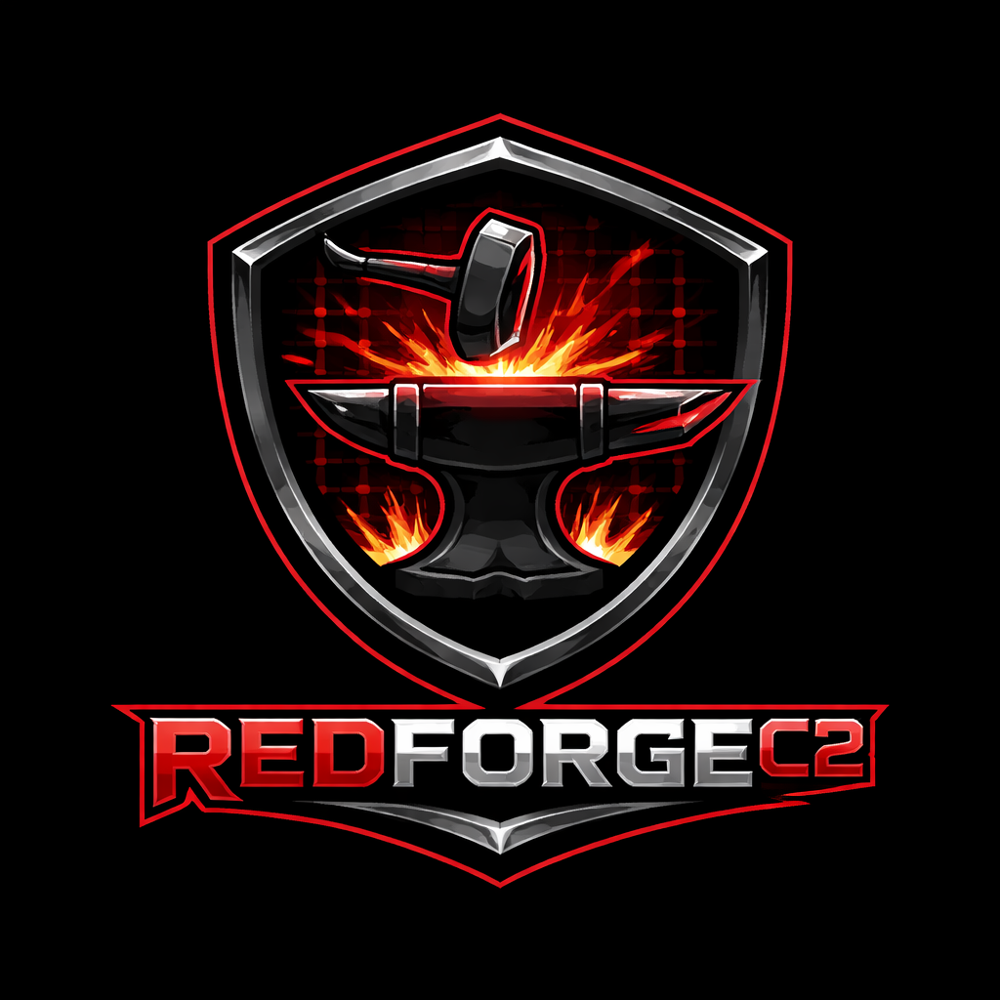
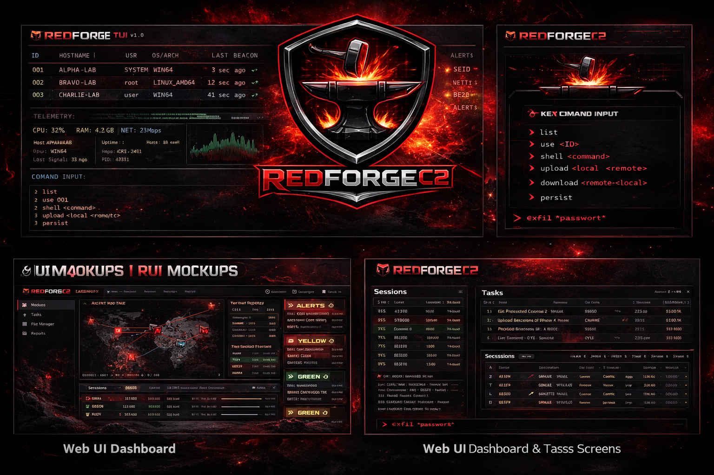

# RedForgeC2 — Modular C2 Lab Simulation (Education-Only)



**RedForgeC2** is a **simulation-only** educational project for **local lab** red-team / purple-team exercises. It uses safe skeleton components (Rust agents, Python/Go teamserver, and operator UIs) to simulate agent registration, telemetry, and tasking **without executing real commands on hosts**.

⚠️ **DISCLAIMER**  
For **education and authorized lab simulation only**. Do not target real systems or networks. Run only on isolated VMs, sandbox networks, or Docker labs.

---

## 🚀 Features (Simulation-Only)

- Rust agent skeleton that sends **mock telemetry** (JSON)  
- Local-only teamserver skeleton (Python/Go) that returns **mock tasks**  
- Modular protocol and task queue **simulation**  
- TUI + Web UI dashboards for training and demonstrations  
- Docker/VM lab support (isolated only)  

---

## 🛠 Technology Stack (Planned)

| Component        | Technology / Language             |
|-----------------|----------------------------------|
| Teamserver       | Go (local-only API + task queue simulation) |
| Agent            | Rust (local-only protocol simulation) |
| Operator Console | TUI + Web UI (React/TypeScript) |
| Storage          | SQLite (optional; simulation logs only) |
| Transport        | HTTP/WebSocket on `localhost` (or Docker network) |
| Build & Scripts  | Make, Shell, Docker |

---

## 📁 Repository Structure

```

RedForgeC2/
├─ agents/         # Simulation agents (Rust + mocks)
├─ server/         # Teamserver backend (Go)
├─ ui/             # Operator UIs (TUI + Web)
├─ docs/           # Documentation & UI mockups
├─ scripts/        # Build, deploy, lab scripts
├─ tests/          # Unit & integration tests
├─ ci_cd/          # CI/CD notes (workflows in .github/)
├─ docker/         # Lab containers
├─ .github/        # GitHub Actions workflows
├─ README.md
├─ LICENSE
└─ Makefile

````

---

## ⚙️ Quick Start (Scaffold)

### 1. Install Dependencies

```bash
This repo is currently a scaffold. As components are implemented, this section will be updated with lab-safe commands.
````

Safety reminder: all networking and “tasking” is local simulation only.

---

## 🧩 Simulation Workflow

1. **Agent Registration (Mock):** UUID + synthetic metadata
2. **Heartbeat (Mock):** periodic check-in for UI demos
3. **Task Assignment (Mock):** server returns predefined “tasks”
4. **Telemetry (Mock):** JSON events (CPU/mem/network-like samples)
5. **Outcome (Mock):** task results are simulated and logged

---

## 📊 UI Screenshots / Mockups


*Mockups for the initial operator experience.*

---

## 📝 Documentation

* [Repo Structure](docs/repo-structure.md)
* [Agent ↔ Teamserver Protocol](docs/protocol.md)
* [UI Mockups](docs/ui-mockups.md) (see also `UI-MOCKUPS.md`)
* [Rust Agent Architecture](docs/agent-architecture.md)
* [Roadmap & Dev Plan](docs/roadmap.md)

---

## 🧪 Testing

* Unit tests: `cargo test` (agent) / `go test ./...` (teamserver)
* Integration tests: `tests/integration/`
* E2E tests: Simulated lab environment via Docker

---

## 🔐 Security & Safety Guidelines

* Run only in isolated lab environments
* Default-bind services to `127.0.0.1` / `localhost`
* Treat all tasks as mocked actions; do not execute host commands
* Keep sensitive keys out of source control (`.env`, `.pem`, `.db`)
* Document simulations for authorized training and QA

---

## 📄 License

Licensed under the **Business Source License 1.1 (BSL 1.1)**.

- Change Date: **2033-03-13**
- Change License: **Apache-2.0**

See `LICENSE` for the full text.

---

**RedForgeC2** — Lab-safe simulation, modular architecture, and training-focused UIs.

---
