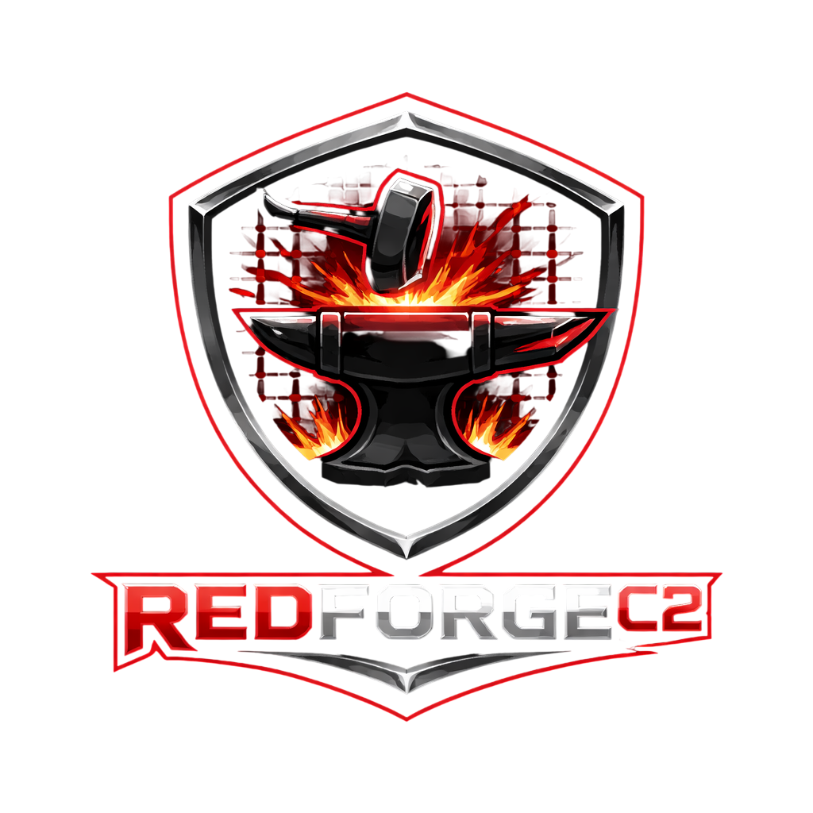

# RedForgeC2
### Next-Generation Adversary Emulation & Sovereign Infrastructure Platform

[](https://nyxeralabs.com)
[](https://github.com/nyxeralabs/redforgec2)
[](https://github.com/nyxeralabs/redforgec2/actions)
[](LICENSE)
[](https://nyxeralabs.com)
[](https://www.rust-lang.org/)
[](https://golang.org/)

<br>

<br>

**RedForgeC2** is an industrial-strength, highly evasive Command & Control (C2) and Adversary Emulation framework developed by **NyxeraLabs**. Engineered strictly for authorized Red Team engagements, Purple Team exercises, and advanced threat validation.

</div>

> ⚠️ **LEGAL & ETHICAL DISCLAIMER**  
> RedForgeC2 is a commercial product developed by NyxeraLabs **strictly for authorized security testing and defensive posture validation**. It is NOT a malicious tool. Unauthorized use against systems you do not own or lack explicit permission to test is strictly prohibited and illegal. NyxeraLabs assumes no liability for the misuse of this framework.

---

## 🔥 Apex Capabilities

### 🛡️ Advanced Memory Evasion (Tier-1 Native Implants)
- **Zero-Footprint Execution:** Indirect Syscalls (Hell's/Halo's Gate), hardware-breakpoint ETW/AMSI blindfolding.
- **Sleep Obfuscation:** Ekko-style timer-queue heap encryption with ROP-chain call stack spoofing (FOLIAGE/DeathSleep).
- **Module Stomping:** Phantom DLL hollowing and arbitrary thread-hijacking for execution masking.

### 🏭 The "Forge" Pattern (Dynamic Compilation)
- **Server-Side Cross-Compilation:** Embedded LLVM/Clang container generating heavily obfuscated, environment-specific payloads on demand.
- **Malleable C2 Profiles:** YAML-driven dynamic injection of sleep timers, jitter, HTTP headers, and Jarm/JA3 TLS spoofing into the Rust AST prior to compilation.
- **Binary Obfuscation:** Automated O-LLVM passes (Control Flow Flattening), `.rdata` string encryption, and forged code-signing.

### 🌐 Distributed "Multi-Player" Architecture
- **gRPC Headless Teamserver:** Fully decoupled, headless Go daemon with Redis/NATS pub-sub for global synchronization.
- **P2P Mesh Routing:** SMB Named Pipes and TCP Bind/Reverse transports for deep internal subnet traversal.
- **Zero-Trust Access:** mTLS Operator-to-Server communication, FIDO2/WebAuthn MFA, and cryptographic task watermarking (Four-Eyes execution authorization).

### 💻 High-Fidelity Operator Interfaces (Dual-Client)
- **Sliver-Style TUI:** Blazing fast, Rust/Ratatui-powered terminal client with Braille-character ASCII sparklines, historical scrolling, and context-aware command palettes.
- **Havoc-Style Web/Desktop UI:** React/Tauri graphical client featuring WebGL geo-spatial mapping, D3.js network node graphs, and tear-off windowing (`rc-dock`).

### 🧩 "Anvil" Engine & Polyglot Ecosystem
- **In-Memory Object Execution:** Native COFF/ELF loader for seamless Cobalt Strike BOF compatibility, plus inline C#/.NET assembly execution via CLR hosting.
- **Apple Silicon Supremacy:** Tier-1 Swift/Mach-O implants designed to subvert macOS Endpoint Security Frameworks (ESF) and TCC.
- **Cloud Native Ops:** Entra ID Primary Refresh Token (PRT) extraction, Azure/AWS IMDS pivoting, and OAuth Device Code phishing.

---

## 🛠 Technology Stack

| Domain | Technologies Utilized |
| :--- | :--- |
| **Teamserver / Core Backend** | Go (Golang), gRPC, Protocol Buffers, PostgreSQL (FLE Encrypted), Redis |
| **Tier 1 Agents (Desktop)** | Rust (`no_std` capable), Swift/Objective-C (macOS), C/C++ (BOFs) |
| **Tier 2/3 Agents (Pivot/Mobile)** | Go (Infra/Routing Nodes), Kotlin/JNI (Android/Dalvik) |
| **Operator UI (Graphical)** | React, TypeScript, Tauri, WebGL, D3.js, TailwindCSS |
| **Operator TUI (Terminal)** | Rust (`ratatui`) / Go (`bubbletea`) |
| **Cryptography & OpSec** | XChaCha20-Poly1305, Ed25519, mTLS, LUKS2, AES-GCM |

---

## 📁 Sovereign Repository Structure

```text
RedForgeC2/
├─ teamserver/       # Headless Go gRPC Daemon & C2 Router
├─ forge-compiler/   # Dockerized LLVM/Rust dynamic payload generator
├─ agents/           # Polyglot Implant Ecosystem
│  ├─ forge-rust/    # Tier 1 Windows/Linux Evasive Implant
│  ├─ forge-swift/   # Tier 1 macOS / Apple Silicon Implant
│  ├─ forge-go/      # Tier 3 SOCKS5/Pivot Infrastructure Node
│  └─ forge-kotlin/  # Tier 2 Android JNI Implant
├─ clients/          # Operator Interfaces
│  ├─ desktop-ui/    # React/Tauri Graphical Client (Havoc-style)
│  └─ term-ui/       # Ratatui Terminal Client (Sliver-style)
├─ armory/           # "ForgeScript" Python/Lua APIs & BOF library
├─ infra/            # Terraform/Pulumi scripts for Fast-Flux Redirectors
├─ docs/             # Architecture, Threat Models, and OpSec guidelines
├─ README.md
└─ LICENSE
```

---

## ⚙️ Quick Start (Lab Environment)

*Note: For production deployments utilizing Fast-Flux redirectors and HSM-backed keys, refer to `docs/infrastructure-deployment.md`.*

### 1. Initialize the Sovereign Lab
```bash
# Spins up the encrypted Postgres DB, Redis pub/sub, and the 'Forge' compiler container
make lab-up
```

### 2. Launch the Headless Teamserver
```bash
cd teamserver
go mod tidy
# Generates ephemeral mTLS certs and starts the gRPC daemon
go run cmd/teamserver/main.go --env=lab
```

### 3. Connect via Operator Client
**For Graphical UI (Tauri/React):**
```bash
cd clients/desktop-ui
npm install && npm run tauri dev
```
**For Terminal UI (Rust):**
```bash
cd clients/term-ui
cargo run --release -- --connect 127.0.0.1:50051 --cert operator.pem
```

### 4. Forge a Payload
From the client command palette:
```text
> forge generate --os windows --arch x86_64 --profile stealth-smb --sleep 30s --jitter 15
[+] Forging payload... Injecting Malleable Profile... Compiling via LLVM...
[+] Payload successfully forged and signed. Saved to /loot/payloads/update_win64.exe
```

---

## 📊 Visual Telemetry & Interface

  
*RedForgeC2 Dual-Client Architecture: Featuring the Ratatui-based TUI and the React-based WebGL Desktop UI with geo-spatial tracking and high-density session grids.*

---

## 🔐 Military-Grade Security & OpSec

RedForgeC2 operates on a strict Zero-Trust model to protect operator identity and client data:
* **RAM-Only Execution:** Teamserver is designed to be booted via Live CD into a `tmpfs` RAM disk.
* **Dead Man's Switch:** eBPF tamper detection triggers immediate `/dev/urandom` memory wipes and kernel panics upon unauthorized physical/SSH access.
* **Traffic Laundering:** Native support for JA3/JA4 TLS fingerprint filtering, Domain Fronting, and automatic Nginx/HAProxy redirector rotation.
* **Database Encryption:** PostgreSQL utilizes Field-Level Encryption (FLE) for all task outputs and loots, backed by Tang network-bound LUKS2 disk encryption.

---

<div align="center">

**RedForgeC2 by NyxeraLabs** — Infiltrate. Emulate. Dominate.

<br>

`Licensed under the Business Source License 1.1 (BSL 1.1). Change Date: 2033-03-13 to Apache-2.0. See LICENSE for details.`

**© 2026 NyxeraLabs All rights reserved.**  
*Enterprise commercial licensing, dedicated support, and specialized modules are available exclusively to vetted organizations.*

---
